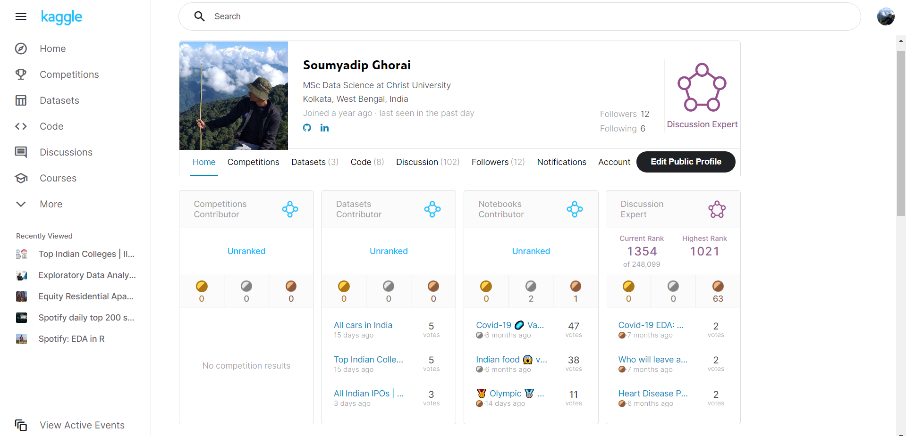

## 
Web scraping with BS4

 ###  Datasets : 
 * All Cars Dataset
 * College Data 
 * IPO 
  
This is a repo where I upload all the datasets that I have scraped from several websites along with their code. I have used Beautiful Soup here... 
  
Some of them are very basic, some of them are a bit advance but its very easy and fun to do. 
  
  Beautiful Soup is a Python library for pulling data out of HTML and XML files. It works with your favorite parser to provide idiomatic ways of navigating, searching, and modifying the parse tree. It commonly saves programmers hours or days of work. 
  
  You can either check the [documentation](https://www.crummy.com/software/BeautifulSoup/bs4/doc/) or refer to my [kaggle notebook](https://www.kaggle.com/soumyadipghorai/web-scrapping-with-bs4-part-1) to learn the basics...
  
  
Also you can find all the datasets on my [kaggle](https://www.kaggle.com/soumyadipghorai) profile, along with the datasets you might find some interesting **EDAs** over there. 

  
  
<!--  -->
 
## If you Liked this project the you can consider connecting with me:
* [LinkedIn](https://www.linkedin.com/in/soumyadip-ghorai/) 

* You can find my other projects and EDAs on [Kaggle](https://www.kaggle.com/soumyadipghorai)
Footer
© 2023 GitHub, Inc.
Footer navigation
Terms
Privacy
Security
Status
Docs
Contact GitHub
Pricing
API
Training
Blog
About
web-scraping-with-bs4/README.md at master · soumyadipghorai/web-scraping-with-bs4 · GitHub 